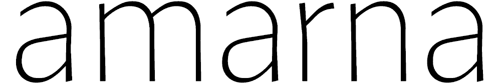
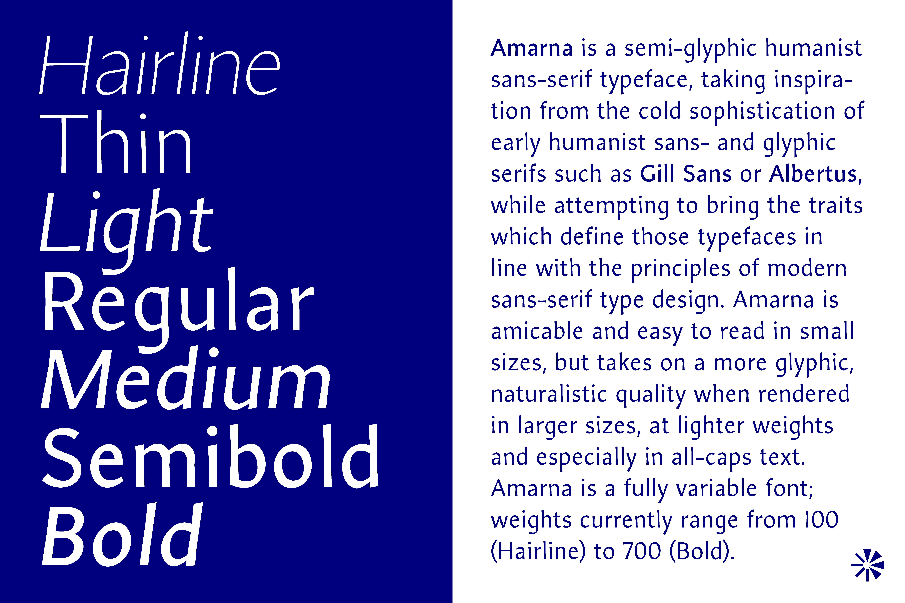

# Amarna



## Description
**Amarna** is a semi-glyphic humanist sans-serif typeface, taking inspiration from the cold sophistication of early humanist sans- and glyphic serifs such as [Gill Sans](https://en.wikipedia.org/wiki/Gill_Sans/) or [Albertus](https://en.wikipedia.org/wiki/Albertus_(typeface)), while attempting to bring the traits which define those typefaces in line with the principles of modern sans-serif type design. Amarna is amicable and easy to read in small sizes, but takes on a much more glyphic, naturalistic quality when rendered in larger sizes, at lighter weights and especially in all-caps text.
Amarna is a fully variable font in both weight and italic axes, with weights currently ranging from 100 (Hairline) to 700 (Bold).

## Build
Amarna can be built locally by running
```gftools builder config.yaml```
in the `sources` directory of the project.

## Contributors
Amarna was designed by Ishtar van Looy.
Copyright 2024–2025 Ishtar van Looy (ishvanlooy@gmail.com).

## License
This Font Software is licensed under the SIL Open Font License, Version 1.1. This license is in this repo at `OFL.txt` and is also available with a FAQ at: https://scripts.sil.org/OFL.

## Sample image
